# 🎙️ Real-Time Audio Worklet Recorder

<div align="center">


**A high-performance real-time audio processing system built with Audio Worklet API for seamless integration with OpenAI's Realtime API**

[✨ Features](#-features) • [🏗️ Architecture](#%EF%B8%8F-architecture) • [🚀 Quick Start](#-quick-start) • [📖 API Reference](#-api-reference)

</div>

---

## 🎯 Overview

This project demonstrates a **production-ready real-time audio streaming system** that captures microphone input, processes it through the Audio Worklet API, converts it to the precise format required by OpenAI's Realtime API (PCM16 at 24kHz), and streams it via WebSocket for seamless voice AI interactions.

The system functions as a **live audio bridge** between your microphone and OpenAI's Realtime API, enabling natural conversation flows with AI assistants. Rather than traditional recording sessions, it maintains persistent connections for continuous audio streaming and real-time AI responses.

### 🎪 What Makes This Special?

- **🔥 Audio Worklet API**: Processes audio in a dedicated thread for zero-latency performance
- **⚡ Real-time Streaming**: Sub-millisecond audio processing with continuous live streaming
- **🎵 Smart Resampling**: Advanced resampling from any input rate to 24kHz with anti-aliasing filter
- **🔊 PCM16 Precision**: Bit-perfect conversion from Float32 to 16-bit PCM with proper scaling
- **🔄 WebSocket Streaming**: Efficient base64-encoded audio chunks for real-time transmission
- **🎛️ Live Controls**: Connect/disconnect and mute/unmute without session interruption
- **📊 Audio Validation**: Comprehensive pipeline testing and quality validation
- **🏗️ Clean Architecture**: Modular, testable, and maintainable TypeScript codebase
- **🎵 Session Recording**: Generate downloadable WAV files from streaming sessions
- **📱 Modern UI**: React 19 with TailwindCSS 4.x, advanced components, and dark mode support
- **🔌 Smart Cleanup**: Comprehensive resource management for connection lifecycle

---

## ✨ Features

### 🎙️ **Advanced Audio Capture**
- **Multi-format Support**: Automatically handles different microphone sample rates
- **Smart Resampling**: Built-in resampling from 44.1kHz/48kHz to 24kHz with anti-aliasing filter
- **Quality Validation**: Real-time audio data validation with NaN/Infinity detection
- **Memory Efficient**: Optimized buffer management for long streaming sessions

### ⚡ **Real-Time Streaming**
- **Audio Worklet Integration**: Processes audio in a dedicated thread for maximum performance
- **Zero-Latency Connection**: Instant connect/disconnect with comprehensive resource cleanup
- **Intelligent Buffering**: Optimized chunk-based streaming with configurable buffer sizes
- **Background Processing**: Non-blocking audio processing pipeline that never freezes the UI
- **Advanced Resampling**: High-quality resampling with 15-coefficient anti-aliasing filter
- **Bidirectional Audio**: Streams outgoing audio and plays incoming AI responses seamlessly

### 🔌 **OpenAI Integration**
- **Realtime API Ready**: Perfect PCM16 24kHz format optimized for OpenAI's requirements
- **WebSocket Streaming**: Seamless backend integration via Socket.IO with connection pooling
- **Session Management**: Robust connection lifecycle with automatic reconnection
- **Error Handling**: Comprehensive error recovery and connection retry logic
- **Live Monitoring**: Real-time transmission statistics and connection status

### 🛠️ **Developer Experience**
- **TypeScript First**: Fully typed codebase with comprehensive interfaces and strict typing
- **Modular Architecture**: Clean separation of concerns with dependency injection
- **Comprehensive Testing**: Built-in audio pipeline validation and quality testing tools
- **Modern Stack**: React 19, Vite 6, TailwindCSS 4, TypeScript 5.8, Biome, and latest web standards
- **Production Ready**: Error boundaries, proper cleanup, and memory management

---

## 🏗️ Architecture

### 📊 **Audio Processing Pipeline**

```mermaid
flowchart LR
    A[🎤 Microphone] --> B[MediaStreamSource]
    B --> C[Audio Worklet]
    C --> D[Float32Array]
    D --> E[Resampler 24kHz]
    E --> F[PCM16 Converter]
    F --> G[Base64 Encoder]
    G --> H[WebSocket Client]
    H --> I[🌐 Backend Server]
    I --> J[🤖 OpenAI API]
```



### 🔄 **Data Flow Detailed**

1. **🎤 Audio Capture**
   ```typescript
   navigator.mediaDevices.getUserMedia() → MediaStream
   ```

2. **⚙️ Worklet Processing**
   ```typescript
   AudioWorklet.process() → Float32Array[128 samples]
   ```

3. **🔄 Resampling** 
   ```typescript
   44.1kHz/48kHz → 24kHz (OpenAI requirement)
   ```

4. **🎵 Format Conversion**
   ```typescript
   Float32Array → PCM16 ArrayBuffer
   ```

5. **📦 Encoding & Transmission**
   ```typescript
   ArrayBuffer → Base64 → WebSocket → Backend
   ```

### 🗂️ **Project Structure**

```
src/
├── 🎵 components/
│   ├── recorder-audio/                 # Main streaming interface and hooks
│   │   ├── recorder-audio.tsx          # Connect/Disconnect controls with live status
│   │   ├── index.ts                    # Export definitions
│   │   └── hooks/                      # Specialized hooks for streaming functionality
│   │       ├── use-audio-streaming.ts  # Real-time audio playback from AI responses
│   │       ├── use-openai-connection.ts# WebSocket connection management
│   │       ├── use-recording-control.ts# Connect/disconnect logic and cleanup
│   │       ├── use-recorder-audio.ts   # Audio processing coordination
│   │       ├── types.ts                # Hook type definitions
│   │       └── index.ts                # Hook exports
│   ├── error-boundary.tsx              # Error handling and recovery
│   └── ui/                             # Reusable UI components
│       ├── avatar.tsx                  # Avatar component
│       ├── badge.tsx                   # Badge component
│       ├── button.tsx                  # Button component
│       ├── collapsible.tsx             # Collapsible component
│       ├── scroll-area.tsx             # Scroll area component
│       ├── select.tsx                  # Select component
│       ├── sonner.tsx                  # Toast notifications
│       └── textarea.tsx                # Textarea component
├── 🔧 hooks/
│   └── use-audio-recording.ts          # Core audio recording state & resource management
├── 🏗️ services/
│   ├── audio-processor.ts              # Core audio data processing & validation
│   ├── audio-recording-service.ts      # Main recording service coordinator
│   └── openai-websocket-client.ts      # WebSocket communication layer
├── 🛠️ utils/
│   ├── audio-utils.ts                  # Core audio conversion utilities
│   ├── audio-validation.ts            # Comprehensive audio pipeline testing
│   └── wav-utils.ts                   # WAV file generation utilities
├── 📚 lib/
│   └── utils.ts                        # General utility functions
├── app.tsx                             # Main application component
├── main.tsx                            # Application entry point
├── index.css                           # Global styles
└── vite-env.d.ts                       # Vite type definitions

📁 public/
├── audio-processor.js                  # Audio Worklet implementation
└── vite.svg                           # Vite logo
```

---

## 🚀 Quick Start

### 📋 **Prerequisites**

- **Node.js** 18+ (LTS recommended)
- **Modern Browser** with Audio Worklet support (Chrome 66+, Firefox 76+, Safari 14.1+)
- **HTTPS** (required for microphone access in production)
- **Backend Server** (optional, for OpenAI integration)

### ⚡ **Installation**

```bash
# Clone the repository
git clone https://github.com/alyssonbarrera/audio-worklet-recorder.git
cd audio-worklet-recorder

# Install dependencies (recommended: pnpm)
pnpm install
# or
npm install
# or
yarn install
```

### 🏃‍♂️ **Development**

```bash
# Start development server
pnpm dev

# Open your browser and navigate to http://localhost:5173
```

### 🔨 **Build for Production**

```bash
# Build the project
pnpm build

# Preview the production build
pnpm preview
```

---

## 🎮 Usage Guide

### 🎙️ **Basic Usage**

1. **� Connect**: Click "Connect" to initialize the OpenAI connection and start live audio streaming
2. **🔇 Mute Control**: Use the mute button to pause/resume audio processing without disconnecting
3. **🔌 Disconnect**: Click "Disconnect" to end the session, cleanup all resources, and generate playback
4. **🎵 Playback**: Listen to your recorded audio with the built-in audio player
5. **📊 Pipeline Testing**: Use "Test Audio Pipeline" to validate the conversion process

### 🌊 **Real-Time Streaming Flow**

When you click "Connect", the application:
- **Initializes** the microphone and audio processing pipeline
- **Connects** to the OpenAI WebSocket for real-time communication  
- **Streams** live audio (PCM16 24kHz) to OpenAI's Realtime API
- **Receives** and plays AI responses in real-time
- **Maintains** the connection for continuous conversation

When you click "Disconnect", the application:
- **Stops** all audio streaming and processing
- **Closes** the OpenAI WebSocket connection
- **Cleans up** all audio resources (contexts, streams, buffers)
- **Generates** a downloadable WAV file from the session

### 🧪 **Testing Audio Pipeline**

The application includes a comprehensive testing suite accessible via the UI:

```typescript
// Test the entire audio conversion pipeline
await testAudioConversionPipeline();
```

This validates:
- ✅ Float32 to PCM16 conversion accuracy with bit-perfect precision
- ✅ Resampling algorithm quality with anti-aliasing validation
- ✅ Base64 encoding/decoding integrity with round-trip testing  
- ✅ Audio data validation logic with edge case detection
- ✅ Sine wave generation for known-good test data

### 🌐 **WebSocket Integration**

For OpenAI integration, you'll need a backend server. See [WEBSOCKET_INTEGRATION.md](./WEBSOCKET_INTEGRATION.md) for detailed setup instructions.

**Quick Backend Setup:**
```javascript
// Example Socket.IO server
const io = require('socket.io')(3000);

io.on('connection', (socket) => {
  socket.on('audio_chunk', (base64Audio) => {
    // Forward to OpenAI Realtime API
    openaiWebSocket.send({
      type: 'input_audio_buffer.append',
      audio: base64Audio
    });
  });
});
```

---

## 📖 API Reference

### 🎵 **AudioRecordingService**

Main service class that orchestrates the entire real-time audio streaming pipeline.

```typescript
class AudioRecordingService {
  // Initialize with optional PCM data callback
  constructor(onPCMDataReady?: (pcmBuffer: ArrayBuffer) => void)
  
  // Setup audio worklet and connect audio nodes
  setupAudioWorklet(audioContext: AudioContext, stream: MediaStream): Promise<AudioWorkletNode>
  
  // Get media stream with audio constraints
  getMediaStream(): Promise<MediaStream>
  
  // Control mute state during streaming
  setMuted(muted: boolean): void
  toggleMute(): boolean
  
  // OpenAI connection management with complete cleanup
  initializeOpenAIConnection(): Promise<void>
  closeOpenAIConnection(): void // Now includes comprehensive resource cleanup
}
```

### 🔧 **Audio Utilities**

Core audio processing functions with optimized algorithms and comprehensive error handling.

```typescript
// Convert Float32Array to 16-bit PCM with proper scaling and clamping
function floatTo16BitPCM(float32Array: Float32Array): ArrayBuffer

// Encode audio data to base64 for efficient transmission
function base64EncodeAudio(float32Array: Float32Array): string

// Create PCM buffer from float data with validation
function createPCMBuffer(float32Array: Float32Array): ArrayBuffer

// Combine multiple audio buffers with memory optimization
function combineAudioBuffers(buffers: Float32Array[]): Float32Array

// Convert any ArrayBuffer to base64 with chunked processing
function arrayBufferToBase64(arrayBuffer: ArrayBuffer): string
```

### 🔌 **WebSocket Client**

Manages real-time communication with the backend with robust error handling.

```typescript
// Connection management with retry logic
function connect(): Promise<void>
function disconnect(): void

// Session control with proper lifecycle management
function startSession(): Promise<void>
function endSession(): void

// Audio streaming with validation
function sendAudioChunk(base64Audio: string): void
function notifyMute(): void

// Status monitoring and analytics
function getConnectionStatus(): { isConnected: boolean; isSessionActive: boolean }
function getTransmissionStats(): TransmissionStats
function resetTransmissionStats(): void
```

---

## 🔧 Technical Deep Dive

### 🎵 **Audio Worklet Implementation**

The Audio Worklet runs in a separate thread and processes audio in 128-sample chunks:

```javascript
// public/audio-processor.js
class AudioProcessor extends AudioWorkletProcessor {
  process(inputs, outputs, parameters) {
    const input = inputs[0];
    if (input.length > 0) {
      const inputData = input[0]; // Float32Array[128]
      
      // Process original data
      this.port.postMessage({
        type: 'audioData',
        originalData: inputData,
        resampledData: this.resample(inputData, 24000)
      });
    }
    return true;
  }
}
```

### 🔄 **Resampling Algorithm**

High-quality resampling with 15-coefficient anti-aliasing filter for optimal audio quality:

```typescript
function resampleTo24kHz(inputData: Float32Array, inputSampleRate: number): Float32Array {
  if (inputSampleRate === 24_000) {
    return inputData; // No resampling needed
  }

  const ratio = inputSampleRate / 24_000;
  const outputLength = Math.round(inputData.length / ratio);
  const output = new Float32Array(outputLength);
  
  // Advanced 15-coefficient anti-aliasing filter
  const filterCoefficients = [
    0.006, 0.019, 0.032, 0.045, 0.058, 0.069, 0.077, 0.08, 0.077, 
    0.069, 0.058, 0.045, 0.032, 0.019, 0.006,
  ];
  
  // Apply filter with proper boundary handling
  for (let i = 0; i < outputLength; i++) {
    const inputIndex = i * ratio;
    let sum = 0;
    
    for (let j = 0; j < filterCoefficients.length; j++) {
      const sampleIndex = Math.floor(inputIndex - 7 + j); // Center filter
      if (sampleIndex >= 0 && sampleIndex < inputData.length) {
        sum += inputData[sampleIndex] * filterCoefficients[j];
      }
    }
    output[i] = sum;
  }
  
  return output;
}
```

### 🎯 **PCM16 Conversion**

Bit-perfect conversion from Float32 to 16-bit PCM:

```typescript
function floatTo16BitPCM(float32Array: Float32Array): ArrayBuffer {
  const arrayBuffer = new ArrayBuffer(float32Array.length * 2);
  const view = new DataView(arrayBuffer);
  
  for (let i = 0; i < float32Array.length; i++) {
    // Clamp to [-1, 1] range and scale to 16-bit
    const clampedValue = Math.max(-1, Math.min(1, float32Array[i]));
    const sample = Math.round(clampedValue * 32_767);
    
    // Write as little-endian 16-bit signed integer
    view.setInt16(i * 2, sample, true);
  }
  
  return arrayBuffer;
}
```

---

## 🐛 Troubleshooting

### 🔊 **Audio Issues**

**Problem**: No audio input detected
```bash
# Check microphone permissions in browser
# Chrome: Settings → Privacy and security → Site Settings → Microphone
# Firefox: Preferences → Privacy & Security → Permissions → Microphone
# Also ensure HTTPS in production environments
```

**Problem**: Poor audio quality or distortion
```typescript
// Verify sample rate conversion and validation
console.log('Input sample rate:', audioContext.sampleRate);
console.log('Output sample rate: 24000'); // Should always be 24000 for OpenAI

// Check audio validation results
const validation = validateAudioData(audioData);
console.log('Audio validation:', validation);
```

**Problem**: Audio cutting out or choppy
```typescript
// Check buffer sizes and processing timing
const stats = getTransmissionStats();
console.log('Chunks sent:', stats.audioChunksSent);
console.log('Average chunk size:', stats.averageChunkSize);
```

### 🌐 **WebSocket Issues**

**Problem**: Connection failed or "Not connected to OpenAI"
```bash
# Ensure backend is running on the correct port
node server.js

# Check if port 3000 is available and not blocked
netstat -an | grep 3000  # Linux/macOS
netstat -an | findstr 3000  # Windows

# Verify CORS settings if frontend and backend are on different domains
```

**Problem**: Audio chunks not being received by backend
```typescript
// Check transmission statistics in browser console
const status = getConnectionStatus();
const stats = getTransmissionStats();
console.log('Connection status:', status);
console.log('Transmission stats:', stats);

// Also verify backend is logging received chunks
```

### 🏗️ **Build Issues**

**Problem**: TypeScript compilation errors
```bash
# Clear TypeScript and Vite cache
rm -rf node_modules/.cache
rm -rf dist
pnpm build
```

**Problem**: Module resolution errors
```bash
# Reinstall dependencies and clear lock files
rm -rf node_modules package-lock.json pnpm-lock.yaml
pnpm install
```

**Problem**: Audio Worklet not loading
```bash
# Ensure audio-processor.js is in public folder and served correctly
# Check browser dev tools Network tab for 404 errors
# Verify HTTPS in production (required for Audio Worklet)
```

---

## 🤝 Contributing

We welcome contributions! Please see our contributing guidelines:

1. **🍴 Fork** the repository
2. **🌿 Create** your feature branch (`git checkout -b feature/amazing-feature`)
3. **✅ Test** your changes thoroughly
4. **📝 Commit** your changes (`git commit -m '✨ add amazing feature'`)
5. **🚀 Push** to the branch (`git push origin feature/amazing-feature`)
6. **🔄 Create** a Pull Request

### 🧪 **Running Tests**

```bash
# Start development server
pnpm dev

# Open browser and navigate to http://localhost:5173
# Click "Test Audio Pipeline" in the UI to run comprehensive tests

# The tests will validate:
# ✅ Silent data handling
# ✅ Sine wave generation and processing  
# ✅ PCM16 conversion accuracy
# ✅ Base64 encoding/decoding integrity
# ✅ Round-trip audio processing
# ✅ Audio data validation logic

# Check browser console for detailed test results
```

### 🔧 **Code Quality**

```bash
# Run linting
pnpm lint

# Build for production (includes type checking)
pnpm build

# Format code with Biome
pnpm biome format --write src/
```

---

## 📄 License

This project is licensed under the **MIT License** - see the [LICENSE](./LICENSE) file for details.

---

## 🙏 Acknowledgments

- **Audio Worklet API** - For enabling high-performance audio processing
- **OpenAI** - For providing the Realtime API that inspired this project  
- **React Team** - For the amazing React 19 features and improved performance
- **Vite Team** - For the lightning-fast development experience and HMR
- **TailwindCSS** - For the utility-first CSS framework and design system
- **Biome** - For fast and reliable code formatting and linting
- **Radix UI** - For accessible and customizable UI components
- **Web Audio API** - For making browser-based audio processing possible

---

<div align="center">

**Built with ❤️ by [Alysson Barrera](https://github.com/alyssonbarrera)**

⭐ **Star this repo if it helped you!** ⭐

</div>
